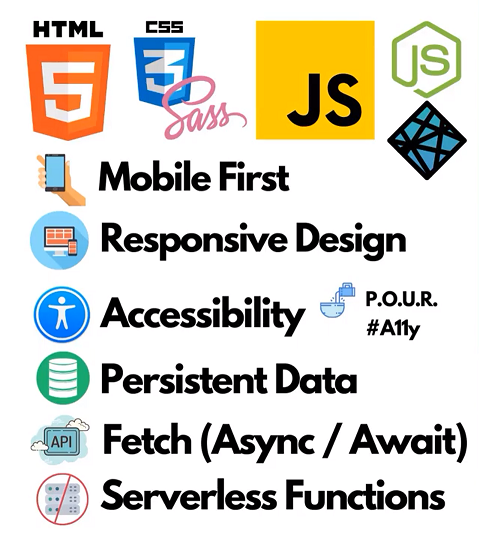

# Weather-App with Vanilla JS by DaveGray feat. Endless

### Link to the Project Tutorial: 

[](https://www.youtube.com/watch?v=s_Ie_yh_4Co)

## Development

Want to contribute? Great!
Open your favorite Terminal and run these commands.

[](https://www.netlify.com/)

Step 1: Install Netlify CLI

```sh
npm install netlify-cli -g
```

Step 2: Start local development server in repo directory

```sh
netlify dev
```

Step 3: Add node-fetch package ( becarefull version over 3.0.0 broke the app in netlify )

```sh
npm i node-fetch
```

## Tech




